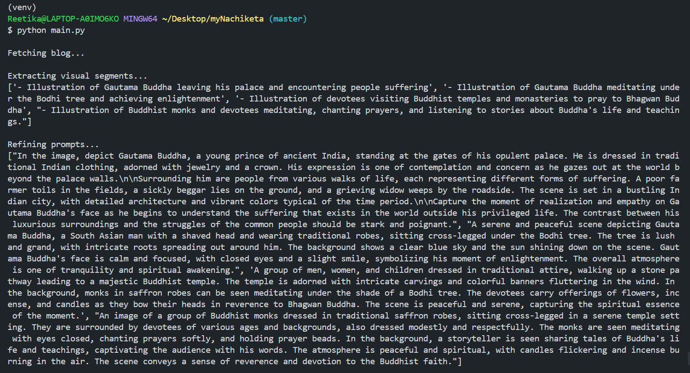
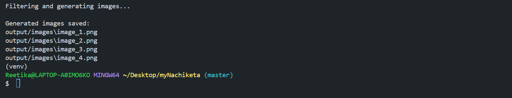
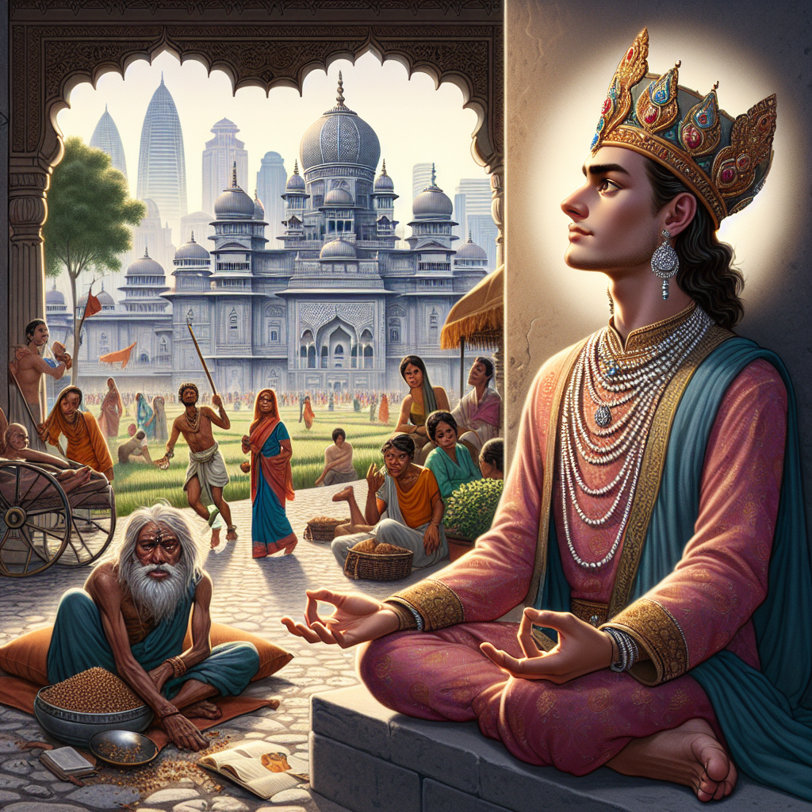
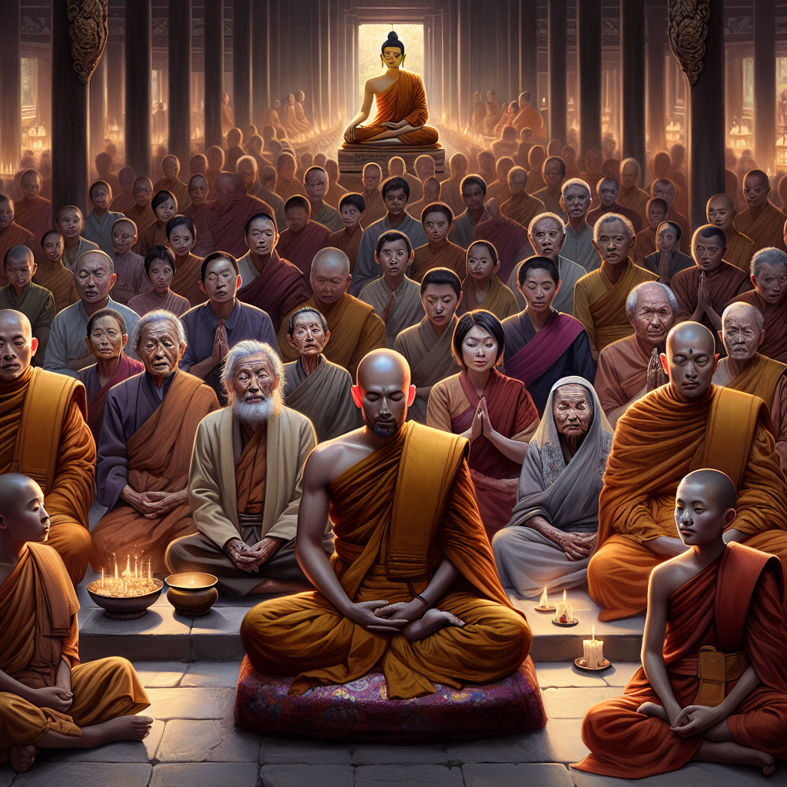

# 🖼️ AI Blog Image Generator using LangChain + OpenAI (DALL·E 3)

This project is a smart AI-powered system that:
- Automatically fetches a blog post from [myNachiketa](https://www.mynachiketa.com)
- Extracts 3–4 key visual moments
- Refines prompts using OpenAI GPT models via LangChain
- Generates vivid, kid-safe illustrations using DALL·E 3
- Saves the output images to a folder

---

## 🚀 Features

✅ Scrape blog content from myNachiketa  
✅ Identify key paragraphs to visualize  
✅ Generate refined, vivid image prompts using LangChain  
✅ Use OpenAI DALL·E 3 to create 1024x1024 images  
✅ Filter prompts for safe, child-appropriate content  
✅ Save images locally in `output/images`  

---

## 🧩 Tech Stack

- Python 3.10+
- LangChain (`langchain`, `langchain-openai`)
- OpenAI SDK (v1.0+)
- Selenium (for dynamic blog content)
- BeautifulSoup (HTML parsing)
- dotenv (for secure API key management)

---

## 🗂️ Folder Structure

```

myNachiketaAI/
├── blog\_fetcher.py           # Scrapes blog content using Selenium
├── text\_analyzer.py          # Extracts visual segments using GPT
├── prompt\_refiner.py         # Refines prompts for DALL·E
├── image\_generator.py        # Uses DALL·E 3 to generate images
├── safety\_checker.py         # Filters unsafe prompts
├── main.py                   # Main orchestrator script
├── output/
│   └── images/               # Generated images saved here
├── .env                      # Secure file to store OpenAI API Key
├── requirements.txt          # Python dependencies
└── README.md                 # Project documentation

````

---

## ⚙️ Setup Instructions

### 1. ✅ Clone the Repository

```bash
git clone https://github.com/your-username/myNachiketaAI.git
cd myNachiketaAI
````

### 2. ✅ Create Virtual Environment

```bash
python -m venv venv
venv\Scripts\activate  # For Windows
# source venv/bin/activate  # For Mac/Linux
```

### 3. ✅ Install Dependencies

```bash
pip install -r requirements.txt
```

### 4. ✅ Set Up OpenAI API Key

Create a file named `.env` in the project root and add your key:

```
OPENAI_API_KEY=sk-xxxxxxxxxxxxxxxxxxxxxxxxxxxxxxxxxxxxxxxx
```

> 🔒 **Important:** Never share your `.env` file or expose your API key publicly.

---

## ▶️ Running the Project

Once set up, just run:

```bash
python main.py
```

It will:

* Ask for a blog URL
* Extract key ideas
* Generate prompts
* Create and save 3–4 child-safe images

---

## 🧪 Sample Blog URL

You can test the system using:

```
https://www.mynachiketa.com/post/speech-on-kabir-das-jayanti-in-english?uniqueIdentifier=aHR1pw1749907013055
```

---

## 🧯 Troubleshooting

### ⚠️ LangChain Warnings

> Problem:

```bash
Importing chat models from langchain is deprecated
```

> ✅ Solution: Make sure you are using `langchain-openai`:

```python
from langchain_openai import ChatOpenAI
```

---

### ❌ `ModuleNotFoundError: No module named 'langchain_openai'`

> ✅ Run:

```bash
pip install langchain-openai
```

---

### ❌ `APIRemovedInV1: openai.Image.create is deprecated`

> ✅ Solution: Use OpenAI SDK v1 syntax:

```python
from openai import OpenAI
client = OpenAI(api_key=your_key)
client.images.generate(...)
```

---

### ❌ Image Not Appearing

> ✅ Ensure you're using `dall-e-3` model and have access on your OpenAI account.
> ✅ Check your `.env` is correctly formatted and not missing the key.

---

## 🧾 Output

After running, check the folder:

```
output/images/
├── image_1.png
├── image_2.png
├── ...
```

Each image corresponds to one refined visual prompt from the blog.

---

## Sample Run
```bash
python main.py
```



Now in the output folder 





## Author
    Build by Reetika

